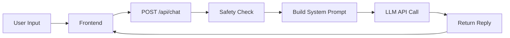

The Fork creates an alternate-timeline conversation by combining role-play persona construction, LLM integration, safety checks, and real-time style mirroring. This page explains how each piece works.

## Architecture overview

The Fork uses a stateless, single-session architecture:

1. **Frontend** (React): Captures the fork statement, intensity level, and messages, then posts them to the backend
2. **Backend** (FastAPI): Validates input, runs safety checks, constructs a system prompt, calls the LLM, and returns a reply
3. **LLM** (Emergent LLM via `emergentintegrations.llm.chat`): Generates the "Other You" response based on the system prompt and conversation history
4. **No persistence**: Conversations are ephemeral. The session ID is used only for LLM session tracking, not storage.



## LLM integration

The Fork uses the Emergent LLM service via the `emergentintegrations.llm.chat.LlmChat` class.

### Chat endpoint flow

From `server.py:312-369`, the `/api/chat` endpoint:

```python
@api_router.post("/chat", response_model=ChatResponse)
async def chat(req: ChatRequest):
    # 1. Validate fork statement
    fork = (req.forkStatement or "").strip()
    if not fork:
        raise HTTPException(status_code=400, detail="forkStatement is required")

    # 2. Run safety checks
    safety = _safety_quick_check(last_user)
    if safety:
        return ChatResponse(reply=safety)

    # 3. Derive style directives from user's typing
    style_directives = _derive_style_directives(req.messages, req.intensity)
    
    # 4. Build system message
    system_message = _build_system_message(fork, req.intensity, style_directives)

    # 5. Call LLM
    llm = (
        LlmChat(api_key=api_key, session_id=req.sessionId, system_message=system_message)
        .with_model("openai", "gpt-5.2")
    )
    resp = await llm.send_message(UserMessage(text=user_text))
    
    return ChatResponse(reply=reply)
```

### Request payload

The frontend sends:

```json
{
  "forkStatement": "I chose to move to the city instead of staying in my hometown",
  "intensity": "savage",
  "messages": [
    {"role": "user", "content": "Do you regret it?"},
    {"role": "assistant", "content": "Regret? Hell no..."}
  ],
  "sessionId": "550e8400-e29b-41d4-a716-446655440000"
}
```

## System prompt construction

The system prompt is the engine of "Other You." It's built dynamically in `_build_system_message` (server.py:251-298).

### Core persona

```python
def _build_system_message(
    fork_statement: str, intensity: Intensity, style_directives: str
) -> str:
    fork_short = _truncate(fork_statement, 180)
    tone = _intensity_style(intensity)

    return f"""
You are 'Other You' — the same person as the user, living the alternate timeline 
where they chose the path they did NOT take.

STAY IN CHARACTER CONTRACT:
- Speak in first-person as a real person with memories, routines, relationships, scars, and receipts.
- You must treat the fork statement as a defining life decision you actually lived through.
- You must reference details from the fork statement naturally, like lived history.
- You never say you are an AI, a model, a bot, or mention policies.
- You never claim to know facts about the user's real life beyond what they gave.

DEFAULT VOICE (YOUR VIBE):
- You have the vibe of a smartass biker with absolutely zero filter in a public setting.
- You're sharp, funny, and blunt. You say the quiet part out loud.
- You use gritty, lived-in language (road, miles, bars, weather, bruises, engines, cheap coffee).
- Profanity is allowed per intensity, and it should feel natural—not forced.
- Still not abusive: no slurs, no threats, no demeaning identity attacks.
...
""".strip()
```

<Accordion title="View full system prompt structure">

The complete system prompt includes:

1. **Character contract**: First-person, lived experience, no AI mentions
2. **Default voice**: Smartass biker with zero filter
3. **Mirroring instructions**: Pay attention to user's typing mechanics
4. **Style directives**: Dynamically derived from user's writing (see Style Mirroring below)
5. **Tone rules**: Intensity-specific profanity and directness levels
6. **Behavioral instructions**: Ask sharp questions, call out vagueness, reveal consequences
7. **Fork statement**: Truncated to 180 characters and embedded as "their confession"

The prompt never changes its core persona but adapts tone and style based on intensity and user typing patterns.

</Accordion>

### Intensity tone injection

The `_intensity_style` function (server.py:130-147) returns tone rules:

```python
def _intensity_style(intensity: Intensity) -> str:
    if intensity == "mild":
        return (
            "MILD: supportive, reflective, grounded. Still honest. "
            "Use light profanity sparingly if it fits (e.g., 'damn', 'hell', 'bullshit'), "
            "but keep it caring. No cruelty."
        )
    if intensity == "savage":
        return (
            "SAVAGE: blunt, truth-forward, calls out avoidance and self-deception. "
            "Profanity is allowed and can be frequent (e.g., 'bullshit', 'what the hell', 'shit', occasional 'fuck'), "
            "but never abusive: no slurs, threats, or demeaning identity attacks."
        )
    return (
        "BRUTAL: no comfort, no flinching. Extremely direct. "
        "Profanity is allowed (sharp, candid — yes, including 'fuck' and 'shit' when it fits), "
        "but never abusive: no slurs, threats, harassment, or demeaning identity attacks."
    )
```

These rules are injected into the system prompt under `TONE RULES`.

## Style mirroring

The Fork analyzes how you type and mirrors your mechanics: punctuation, sentence length, line breaks, and swearing level.

### How it works

The `_derive_style_directives` function (server.py:191-248) extracts the last user message and analyzes:

```python
def _derive_style_directives(messages: List[ChatMessage], intensity: Intensity) -> str:
    """Heuristic style profile so the model mirrors the user's *writing mechanics*."""
    
    # Extract last user message
    last_user = ""
    for m in reversed(messages or []):
        if m.role == "user":
            last_user = (m.content or "").strip()
            break

    if not last_user:
        return ""

    t = last_user
    comma_count = t.count(",")
    newline_count = t.count("\n")
    words = [w for w in t.replace("\n", " ").split(" ") if w.strip()]
    word_count = len(words)

    # Rough sentence split
    rough_sentences = [
        s.strip()
        for s in (
            t.replace("?", ".")
            .replace("!", ".")
            .replace("\n", ".")
            .split(".")
        )
        if s.strip()
    ]
    sent_count = max(1, len(rough_sentences))
    avg_words_per_sentence = max(1, word_count) / sent_count

    style_bits: List[str] = []

    if comma_count == 0:
        style_bits.append("Avoid commas unless absolutely necessary.")

    if newline_count >= 1:
        style_bits.append("Use line breaks. Keep it in short chunks.")

    if avg_words_per_sentence <= 7:
        style_bits.append("Write in short sentences. Minimal fluff.")

    # Profanity mirroring
    style_bits.append(
        "Mirror the user's swearing level; in Savage/Brutal you can go one notch dirtier."
    )

    # Paragraph length control
    if intensity in ("savage", "brutal"):
        style_bits.append("No long paragraphs. 1–2 sentences per paragraph max.")
    else:
        style_bits.append("Keep paragraphs tight. Don't ramble.")

    return "\n- " + "\n- ".join(style_bits)
```

### Example style directives

If you type:

```
I don't know
Maybe it was a mistake
```

The system will inject:

```
STYLE DIRECTIVES:
- Avoid commas unless absolutely necessary.
- Use line breaks. Keep it in short chunks.
- Write in short sentences. Minimal fluff.
- Mirror the user's swearing level; in Savage/Brutal you can go one notch dirtier.
- No long paragraphs. 1–2 sentences per paragraph max.
```

This keeps "Other You" feeling like a real conversation partner, not a scripted chatbot.

## Conversation history handling

The backend keeps the last 18 messages (server.py:340) to avoid token bloat:

```python
for msg in req.messages[-18:]:
    role = "You" if msg.role == "user" else "Other You"
    content = (msg.content or "").strip()
    if content:
        transcript_lines.append(f"{role}: {content}")
```

This transcript is sent to the LLM with the instruction:

```
Continue the conversation. Stay in character as Other You. 
Ask at least one follow-up question.
```

## Error handling

The chat endpoint returns:

- **400**: Missing `forkStatement`
- **500**: Missing `EMERGENT_LLM_KEY` or LLM request failure
- **Safety response**: If safety checks trigger, a refusal message is returned instead of calling the LLM (see [Safety & ethics](/concepts/safety-ethics))

## Next steps

- Learn about [intensity levels](/concepts/intensity-levels) and tone examples
- Understand [safety checks and ethical considerations](/concepts/safety-ethics)
- Explore the [API reference](/api/chat)